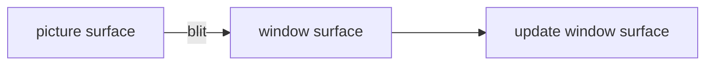

# hello world

基本结构

## show a picture



## event

```cpp
while (SDL_PollEvent(&e)) {
    if (e.type == SDL_QUIT) quit = true;
}
```

每次调用 SDL_PollEvent 都会消耗消息队列里的一个 event, 而 while 的意思是一次性处理所有积压的于队列的 event

## References

1. [SDL2/SDL_Surface - SDL Wiki](https://wiki.libsdl.org/SDL2/SDL_Surface)

   A structure that contains a collection of pixels used in software blitting.
